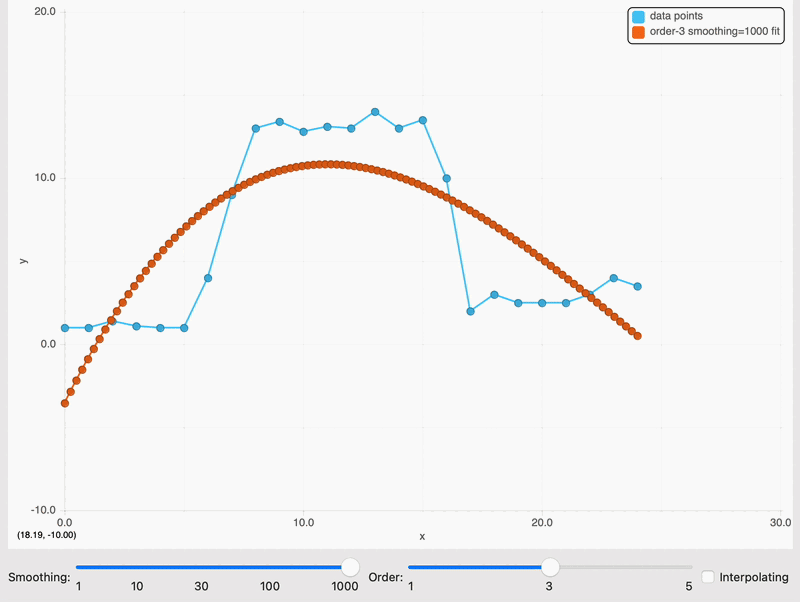

fitpack
===

This is a Modern Fortran translation of the FITPACK package for curve and surface fitting.
The functions are modernized and translated from the original Fortran77 code [FITPACK](http://www.netlib.org/dierckx) by Paul Dierckx.
The starting code used the double precision version of FITPACK distributed with [scipy](http://www.scipy.org).

An object-oriented interface wrapper was also built. A C/C++ interface is also being built. 

### 1D Spline interpolators:

Class      | Description | Degree
---        | ---         | ---
`fitpack_curve` | 1D spline interpolation of scattered data, $y = s(x)$ | up to 5
`fitpack_periodic_curve` | 1D spline interpolation of scattered data on a periodic domain, $y = s(x), s(0) = s(x_{per})$ | up to 5
`fitpack_parametric_curve` | Parametric 1D curves in N dimensions, $x_i = s_i(u)$, $i=1,\ldots,n$ | up to 5
`fitpack_closed_curve` | Closed parametric 1D curves in N dimensions, $x_i = s_i(u)$, $i=1,\ldots,n$, $x_i(0)=x_i(1)$ | up to 5
`fitpack_constrained_curve` | Parametric 1D curves in N dimensions with value/derivative constraints at the endpoints $x_i = s_i(u)$, $i=1,\ldots,n$, $x_{i}^{(j)}(0)=u_{L,i}^{(j)}$ , $x_{i}^{(j)}(1)=u_{R,i}^{(j)}$, $0\le j \le 2$| up to 5

Here is an example from the `mncurf` 1D generic curve fitting test:



This is an example from the parametric curve test `mnpara`: 


### 2D Spline interpolators:

Class      | Description | Degree
---        | ---         | ---
`fitpack_surface` | 2D spline interpolation of scattered data, $z = s(x,y)$ | up to 5
`fitpack_polar` | 2D spline interpolation of scattered data in a user-defined polar domain $z = s(u,v)$, $u\in[0,1]$, $v\in[-\pi,\pi]$, user-defined domain radius as a function of polar angle $r=r(v)$ | 3
`fitpack_sphere` | 2D spline interpolation of scattered data on a sphere domain $z = s(u,v)$ with latitude $u \in [0,\pi]$, longitude $v \in [-\pi,\pi]$ | 3
`fitpack_grid_surface` | 2D spline interpolation of rectangular 2D data $z = s(x,y)$ with gridded fitting coordinates $x_i, i=1,\ldots,n_x$,  $y_j, j=1,\ldots,n_y$  | up to 5
`fitpack_grid_polar` | 2D spline interpolation of polar data $z = s(u,v)$ in the fixed-radius circular polar domain $u\in[0,r]$, $v\in[-\pi,\pi]$, with user-control of function and derivatives at the origin and the boundaries | 3

### `C`, `C++` interfaces

The C and C++ header-only interfaces are found in the `include` folder. The following scheme shows a comparison between the Fortran, C++ and C struct names for the currently available classes: 

Fortran      | C | C++
---        | ---         | ---
`fitpack_curve` | `fitpack_curve_c` | `fpCurve`
`fitpack_periodic_curve` | `fitpack_periodic_curve_c` | `fpPeriodicCurve`
`fitpack_parametric_curve` | `fitpack_parametric_curve_c` | `fpParametricCurve`
`fitpack_closed_curve` | `fitpack_closed_curve_c` | `fpClosedCurve`
`fitpack_constrained_curve` | `fitpack_constrained_curve_c` | `fpConstrainedCurve`

The choice to provide a header-only `C++` implementation is motivated by the need to keep the library C-ABI compatible whatever compiler is being used to build it. For example, on macOS, one may build the library with g++/gfortran, that is not ABI-compatible with clang++. So, it is important that no C++ code is compiled together with the Fortran code in the library.

Building, using
===============

An automated build is available via the Fortran Package Manager. To use FITPACK within your FPM project, add the following to your fpm.toml file:

```
[dependencies]
fitpack = { git="https://github.com/perazz/fitpack.git" }
```

Otherwise, a simple command line build script that builds all modules in the src/ folder is possible. 

Several test programs are available through the Fortran Package manager. To run them, just type
```
fpm test
```
 
References
----------
Fitpack contains very robust algorithms for curve interpolation and fitting, based on algorithms described by Paul Dierckx in Ref [1-4]:<br>

[1] P. Dierckx, "An algorithm for smoothing, differentiation and integration of experimental data using spline functions", J.Comp.Appl.Maths 1 (1975) 165-184.

[2] P. Dierckx, "A fast algorithm for smoothing data on a rectangular grid while using spline functions", SIAM J.Numer.Anal. 19 (1982) 1286-1304.

[3] P. Dierckx, "An improved algorithm for curve fitting with spline functions", report tw54, Dept. Computer Science,K.U. Leuven, 1981.

[4] P. Dierckx, "Curve and surface fitting with splines", Monographs on Numerical Analysis, Oxford University Press, 1993.

[5] P. Dierckx, R. Piessens, "Calculation of Fourier coefficients of discrete functions using cubic splines", Journal of Computational and Applied Mathematics  3(3), 207-209, 1977.

See also
--------
- [Dierckx.jl](https://github.com/kbarbary/Dierckx.jl), a Julia interface to FITPACK
- [scipy.interpolate](https://docs.scipy.org/doc/scipy/reference/interpolate.html), which includes interfaces to FITPACK
